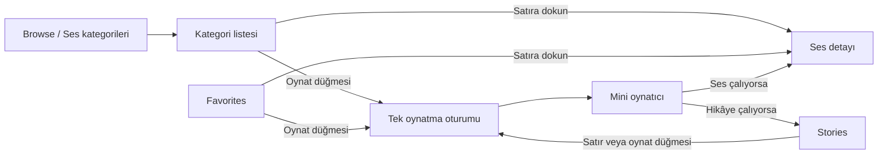

**XWAB — UI, özellikler, gezinme ve etkileşim analizi**

28 Eylül 2026 · Mevcut çalışma ağacı üzerinden inceleme

> Bu belge düzeltmelerden önceki durumu kaydeder. Sonrasında uygulanan değişiklikler ve doğrulama sonuçları için [uygulama notuna](UI_UX_DUZELTMELERI_2026-09-28.md) bakın. Aşağıdaki eski dosya adları tarihsel incelemeye aittir.

> Son ürün kararı: Kullanıcının isteğiyle ilerleme çubuğu ve seek/ileri-geri atlama kapsam dışıdır. Aşağıdaki bu yöndeki öneriler uygulanacak gereksinim değildir.

**Genel değerlendirme**

Kullanıcı dostu olmadığı yönündeki endişeyi destekleyen somut davranışlar var. En önemli sorun, ekranda görünen içerikle kontrol edilen oynatma oturumunun her zaman aynı olmaması. İkinci sorun, aynı görünen satırların seslerde ve hikâyelerde farklı işler yapması. Görsel hiyerarşi de uyumadan önce hızlıca ses açma ve kapanma süresi belirleme görevini yeterince öne çıkarmıyor.

Bununla birlikte üç sekmeli yapı, sekme geçmişinin korunması, ortak bileşenler, büyük oynatma hedefleri ve yükleme/hata durumlarının ele alınması iyi bir temel oluşturuyor. Mevcut gezinme altyapısını tamamen değiştirmeyi gerektiren bir bulgu yok. Öncelik, oynatıcı davranışını ve kontrol kapsamını tutarlı hale getirmek olmalı.

Bu rapor kod ve mevcut test kaynaklarına dayanan bir uzman değerlendirmesidir; kullanıcı testi veya çalışan uygulama üzerinden görsel denetim değildir. `adb devices -l` bağlı cihaz/emülatör göstermedi. Bu nedenle animasyon akıcılığı, gerçek ekrandaki taşmalar, dokunma hissi ve TalkBack/VoiceOver davranışı gözlenmiş sonuç olarak sunulmamıştır. Testler bu analiz sırasında yeniden çalıştırılmadı. Uygulama kodu değiştirilmedi.

**Mevcut özellik ve ekran haritası**

| Alan | Mevcut işlev | Kullanıcının izlediği yol | Değerlendirme |
|---|---|---|---|
| Browse | Beş ses kategorisi; toplam 20 ses | Kategori → ses listesi → isteğe bağlı detay | Sade; sekme adı içeriğini yeterince somut anlatmıyor |
| Category | Liste, satırdan oynatma, favori ekleme/çıkarma | Oynatma düğmesi ses başlatır; satır detay açar | Hızlı oynatma iyi; detay açma işareti zayıf |
| Sound | İçerik başlığı, favori, oynatma, ses seviyesi, tekrar, sayaç | Tam ekran detay | İçerik detayını uygulama genelindeki kontrollerle karıştırıyor |
| Favorites | Kaydedilen sesler, oynatma ve detaya geçiş | Satır → detay | Listede favoriden kaldırma yok; hikâyeler kapsam dışında |
| Stories | Beş hikâye, satırdan oynatma, global sayaç | Satırın her yeri oynat/duraklat | Detay, ilerleme ve arama/atlama kontrolü yok |
| Now playing | Uygulama genelinde başlık, oynatma, yükleme/hata | Çubuğa dokun → ses detayı veya hikâye listesi | Süreklilik iyi; dönüş davranışı içerik türüne göre değişiyor |

Kaynaklar: [sekme tanımları][nav-tabs], [ses kataloğu][catalog], [hikâye kataloğu][stories-catalog], [ekran girişleri][entries].

**Önceliklerin anlamı**

P1: Kullanıcının niyetinden farklı veya görünmeyen bir oynatma etkisi oluşturabilen UX sorunu. P2: Temel görevi zorlaştıran tutarlılık, erişim veya okunabilirlik sorunu. P3: Adlandırma ve keşfedilebilirlik iyileştirmesi. Bunlar UX öncelikleridir; üretimde gözlenmiş çökme dereceleri değildir.

**1. P1 — Bir sesin detayındaki kontroller başka bir içeriği değiştirebiliyor**

Senaryo: Yağmur sesi çalarken başka bir sesin detayını aç. Yeni sesin oynatma düğmesi o sese ait; fakat ses seviyesi, tekrar ve sayaç aynı global oturumu kontrol ediyor. Kullanıcı B sesini ayarladığını düşünürken A sesini, hatta çalan bir hikâyeyi etkileyebilir.

Kodda `playIntent` görüntülenen içerik kimliğiyle filtreleniyor. `volume`, `isLooping` ve sayaç ise oturumdan doğrudan geliyor. `canConfigure` yalnızca `track != null` kontrol ediyor; görüntülenen sesin aktif olması gerekmiyor. Komutlar içerik kimliği taşımadan global `PlaybackPort` üzerinden uygulanıyor. [State][sound-state] · [ViewModel][sound-vm]

Öneri: İçerik detayında yalnız o içeriğe ait eylemleri tut; global ses/tekrar/sayaç kontrollerini aktif içeriği açıkça gösteren ortak oynatıcıda sun. Mevcut tasarım korunacaksa panelde hangi içeriğin değişeceği yazmalı. Başka içerik çalarken B için yapılan ayarın ne zaman uygulanacağı açık bir ürün kuralı olmalı.

Kabul ölçütü: A çalarken B detayında bir kontrol değiştiren kullanıcı, eylemin A'yı etkilediğini işlem öncesinde anlayabilmeli; B'ye özel gibi görünen kontrol A'yı sessizce değiştirmemeli.

**2. P1 — Kullanıcının tekrar tercihi hikâyeye taşınıyor, hikâyede görünmüyor**

Senaryo: Bir ses çalarken `Loop sound` anahtarını kapatıp tekrar aç; ardından hikâye başlat. Açıkça seçilmiş tekrar tercihi korunur ve hikâye de tekrar eder. Hikâyeler ekranında bu durumu gösteren veya kapatan bir kontrol bulunmaz.

Buradaki sorun varsayılanların karışması değildir: sesin varsayılanı tekrar açık, hikâyeninki kapalıdır. Sorun, kullanıcının seçtiği global tercihin `Loop sound` adıyla sunulması ve hikâyede erişilemez hale gelmesidir. Bu davranış mevcut testte de özellikle beklenmektedir. [Tercihin korunması][session-loop] · [Davranış testi][loop-test] · [Hikâye ekranı][stories-screen]

Öneri: Tekrar ayarını içerik türüne göre ayrı tut veya ortak oynatıcıda her tür için görünür yap. Mevcut global davranış korunursa etiketi `Repeat playback` / `Oynatmayı tekrarla` olmalı.

**3. P2 — Aynı görünümlü satıra dokunmak farklı sonuçlar doğuruyor**

Kategori ve Favoriler'de satır gövdesi detay açıyor; yalnız oynat düğmesi oynatıyor. Hikâyeler'de hem gövde hem oynat düğmesi oynat/duraklat yapıyor. Üçü de aynı `PlayableRow` ve `ContentCard` görünümünü kullanıyor. Seslerden öğrenilen davranış hikâyelere taşındığında, kullanıcı bilgi açmayı beklerken mevcut içeriği değiştirebilir veya duraklatabilir. [Kategori][category-screen] · [Favoriler][favorites-screen] · [Hikâye satırı][story-row]

Öneri: Bütün içerik satırlarında gövde detayı/oynatıcıyı açsın; açık oynat düğmesi oynatmayı değiştirsin. Hikâyeler için detay yapılmayacaksa doğrudan oynatma davranışı görünür bir eylem etiketiyle ayrılmalı. İç içe tıklanabilir alanların varlığı tek başına çift tetiklenme hatası değildir; böyle bir hata gözlenmedi.

**4. P2 — Mini oynatıcı hikâyenin kendisini açmıyor**

Ses çalarken çubuğa basmak `SoundRoute(id)` açıyor. Hikâye çalarken yalnız `StoriesRoute` seçiliyor; hikâye kimliği hedefe taşınmıyor. İlgili satıra otomatik kaydırma veya odaklama yok. Hikâyeler zaten açık ve başka bir yere kaydırılmışsa dokunma görünür sonuç vermeyebilir. [Rota eşlemesi][player-routing] · [Liste][stories-screen]

Öneri: Mini oynatıcı her içerikte aynı aktif oynatıcı yüzeyini açmalı. Daha küçük kapsamlı düzeltme, hikâyenin satırına kaydırma ve onu belirginleştirmedir. Görsel açma oku/tutamacı da çubuğun dokunulabilir olduğunu anlatabilir; mevcut erişilebilirlik eylem etiketi olumlu.

**5. P2 — Favoriler ekranı favori yönetimini tamamlamıyor**

Favoriler'de satırdan kaldırma yok. Kullanıcı detaya girip kalbe dokunmalı ve listeye dönmeli. Kategori ekranı ise aynı işlemi satır içinde sunuyor. Böylece favorileri düzenlemek, onları ilk kez eklemekten daha zahmetli oluyor. Boş durumda açıklama var, fakat `Sesleri keşfet` gibi doğrudan bir eylem yok. [Favori satırı][favorites-row] · [Boş durum][favorites-screen]

Öneri: Favoriler satırına favoriden çıkarma ekle; işlem sonrası kısa bir `Geri al` eylemi sun. Bunun için her kaldırmada onay penceresi gerekmez. Boş duruma ses kataloğuna giden tek bir düğme ekle. Hikâyeler kaydedilemiyorsa `Favorites` kapsamını metinde açık tut veya ileride iki içerik türünü de destekle.

**6. P2 — Zamanlayıcının kapsamı ve durumu yeterince görünür değil**

Sayaç ses detayında ve Hikâyeler'de bulunuyor; Browse, Category ve Favorites'te mini oynatıcı kalan süreyi göstermiyor. Kullanıcı uygulama içinde dolaşırken kapanma zamanını görmek ya da değiştirmek için başka ekrana dönmek zorunda.

`15/30/45/60 min` düğmeleri seçim yapıp onay beklemiyor: doğrudan süreyi başlatıyor, yeni dokunma süreyi yeniden kuruyor. Oynatma başlamadan da sayaç başlatılabiliyor. Bunlar geçerli ürün tercihleri olabilir; ancak `15 dakika sonra durdur` gibi bir eylem etiketi, yalnız `15 min` ifadesinden daha açıktır. [Sayaç paneli][timer] · [Mini oynatıcı][mini-player] · [Başlatma koşulları][sound-state] · [Hikâye state][stories-state]

Öneri: Mini oynatıcıda aktif kalan süreyi göster. Zamanlayıcıyı buradan düzenlenebilen ortak bir kontrol yap. Yeniden ayarlama davranışını kısa bir bildirimle belirt. Özel süre ve `hikâye sonunda` seçenekleri ürün geliştirmesidir; mevcut hata düzeltmeleri kadar acil değildir.

**7. P2 — Hikâyelerde karar vermek ve dinlemeyi yönetmek için bilgi eksik**

Hikâye modeli açıklama ve anlatıcı içeriyor; listede yalnız başlık, yazar ve toplam süre gösteriliyor. Detay ekranı yok. Kullanıcı dinlemeden önce hikâyenin tonunu veya anlatıcısını öğrenemiyor. İlerleme göstergesi, konum değiştirme ve kısa geri/ileri atlama da yok; feature'ların kullandığı `PlaybackPort` bunları sunmuyor. [Hikâye verisi][stories-catalog] · [Satır][story-row] · [Oynatma sözleşmesi][playback-port]

Öneri: Hikâye ayrıntısında açıklama, anlatıcı ve süreyi sun; oynatıcıda ilerleme ve geri sarma ekle. Bu özellikler yalnız UI değişikliğiyle tamamlanamaz; oturum sözleşmesi ve platform desteği de gerekir. Mevcut hikâyeler yaklaşık 3–8 dakika olduğundan bunu çok uzun sesli kitap sorunu gibi abartmamak gerekir.

**8. P2 — Ses ekranında dekorasyon, temel kontrollerden önce geliyor**

Üstte 220 dp sabit dekoratif disk, geniş boşluklar ve başlık; ardından oynatma ve kontrol paneli bulunuyor. Ekranın üst/alt içerik boşluğu ayrıca 48'er dp. Hata mesajı kontrol panelinin de sonrasında. Aynı sesin detayında mini oynatıcı da görünmeye devam ederek ikinci bir oynat/duraklat düğmesi oluşturuyor. Küçük ekran veya büyük yazıda sayaç ve hata geri bildiriminin ilk görünümün dışında kalması güçlü bir risktir; piksel düzeyinde canlı ölçüm yapılmadı. [Ses ekranı][sound-screen] · [Boyutlar][dimens] · [Çubuğun her sahneye eklenmesi][scene-bar]

Öneri: Dekoratif alanı ekran yüksekliğine göre küçült; içerik adı, oynatma ve aktif sayaç bilgisini öne al. Hata mesajını oynatma düğmesinin yakınına taşı. Aynı içeriğin tam oynatıcısı açıkken mini çubuğu birleştir/gizle; başka içerik inceleniyorsa global çubuğu koru.

Ekranın kaydırılabilir olması iyi: burada sorun kontrollerin tamamen erişilememesi değil, görev önceliğinin ve ilk görünümün zayıf olmasıdır.

**9. P2 — Tipografi gece kullanımında okunabilirlik riski taşıyor**

`labelMedium` 10 sp, gövde metinleri 12–13 sp, liste başlığı 15 sp/Light. Büyük başlıklar Thin ve 2–6 sp harf aralığı kullanıyor. Süre, yükleme durumu ve zamanlayıcı seçenekleri gibi işlevsel bilgiler küçük stilde gösteriliyor. Ayrıca satır başlıkları ve alt metinleri tek satırla sınırlandırılmış. Kategoride iki aksiyon düğmesi metne kalan alanı daha da azaltıyor. [Tipografi][type] · [Kart][content-card]

Öneri: İşlevsel metinlerde 14–16 sp gövde ve 12–14 sp ikincil metin aralığını başlangıç tasarımı olarak dene; Light/Thin kullanımını azalt. Uzun başlıklara iki satır olanağı sağla. Bu değerler tasarım önerisidir; tek başına bir standart ihlali ölçümü değildir.

Renk paletini tümüyle başarısız saymak doğru olmaz. Mevcut kaynakta metin renkleri ve cam yüzeyleri için kontrast testleri bulunuyor; önceki düşük alfa problemine ait yorumlar güncel bir hatanın kanıtı değildir. [Kontrast testleri][contrast-test]

**10. P2 — Erişilebilirlik adları var, fakat eylem bağlamı eksik**

Oynatma düğmesi yalnız `Play/Pause`, favori düğmesi yalnız `Add/Remove favorites` açıklaması taşıyor. Listede bağımsız odaklanan düğmelerin hangi içeriğe ait olduğu açıkça isme eklenmemiş. Satırın genel `clickable` eyleminde detay açma ile oynatma ayrımı belirtilmiyor. Asenkron yükleme/hata metinleri normal `Text`; kritik değişikliklerin kendiliğinden duyurulması için açık `liveRegion` tanımlanmamış. [Oynatma düğmesi][play-button] · [Favori düğmesi][favorite-button] · [Satır durumları][playable-row]

Öneri: `Rain on the Window — oynat`, `... — favorilerden kaldır` gibi bağlamlı düğme adları ve `Detayı aç` eylem etiketi ekle. Önemli hata ve işlem sonuçlarını uygun semantik bildirimle duyur; saniyelik sayaç güncellemelerini sürekli okutma. Ekran başlıklarını heading olarak işaretlemeyi değerlendir. Gerçek odak sırası ve duyurular TalkBack/VoiceOver ile sınanmalı. Bu öneriler [Android Compose semantik dokümantasyonu](https://developer.android.com/develop/ui/compose/accessibility/semantics) ile uyumludur.

Dokunma hedefleri için olumlu durum var: standart oynat düğmesi 48 dp, büyük düğme 68 dp; 38 dp olan küçük görsel dairedir. Onu dokunma alanı sanıp hedefi küçük diye raporlamak yanlış olur. Diğer temel kontroller Material bileşenlerini kullanır. [Kod][play-button] · [Android varsayılan erişilebilirlik davranışları](https://developer.android.com/develop/ui/compose/accessibility/api-defaults)

**11. P2 — Çevrimdışı kullanılabilirlik kullanıcıya açıklanmıyor**

Sesler ilk oynatmada ağdan alınır ve arka planda önbelleğe indirilmeye çalışılır; hikâyeler stream edilir. UI, hangi sesin cihazda hazır olduğunu veya indirme işleminin tamamlandığını göstermiyor. Uyku öncesinde ağ olmayacak bir ortam için ses seçen kullanıcı sonucu önceden bilemez. Mevcut kod yanlış bir `offline` vaadini kaldırmış; bu olumlu, fakat durum görünürlüğü hâlâ eksik. [Ses çözümleme][sound-resolver] · [Kategori açıklaması][category-strings]

Öneri: Gerçek önbellek durumuna dayanan `Cihazda hazır` / `İnternet gerekli` bilgisi ekle. Sadece daha önce oynatıldı diye çevrimdışı hazır kabul etme. Bu durumun UI'ya taşınması için mevcut domain sözleşmesinde geliştirme gerekecektir.

**12. P3 — Kullanıcıya görünen isimler her yüzeyde aynı kavramı taşımıyor**

| Mevcut ifade | Sorun | Öneri |
|---|---|---|
| Browse + ev ikonu | Ekran yalnız ses kategorileri; genel keşif veya ana sayfa izlenimi veriyor | `Sounds` / `Sesler`, uygun ses/kategori ikonu |
| Favorites | Yalnız sesleri kapsıyor; hikâye favorileri yok | Kapsamı açıklamak veya ortak favorileri desteklemek |
| Stories + liste ikonu | İşlev anlaşılır, ikon içerik türünü ayırt etmiyor | Kitap/hikâye ikonu |
| White Noise kategorisi | Brown, Pink ve Gray Noise da bu kategoride | `Noise` / `Gürültü sesleri` |
| tracks | Uyku sesi bağlamında teknik/müzik odaklı | `sounds` / `ses` |
| Public Domain | Lisans bilgisi temel oynatma satırında yüksek yer tutuyor | Ayrıntı/künye bölümüne taşımak |
| Loop sound | Global tekrar davranışını yalnız bu sese ait gibi anlatıyor | Kontrol kapsamına göre `Bu sesi tekrarla` veya `Oynatmayı tekrarla` |
| Rain on the Window / Gentle Rain | Aynı içerik uygulamada ve platform medya başlığında farklı ad alıyor | Bildirim ve uygulamada ortak kullanıcı başlığı |

`Ontario Waves / Calm Waves` ve `Igbo Lullaby / Egwu Nwa` da son duruma örnektir. Mini oynatıcı uygulama içi ismi kullanır; farklılık esas olarak bildirim/kilit ekranı metadata'sındadır. [Katalog][catalog] · [Resolver][sound-resolver] · [Sekme etiketleri][tab-strings] · [Ortak metinler][ui-strings]

Arayüz kaynakları yalnız İngilizce `values` içeriyor; kategori ve içerik adları da katalogda İngilizce. Türkçe kullanıcı kitlesi hedefleniyorsa bu işlevsel bir erişim engelidir ve P2 önceliğe çıkar. Hedef kitle yalnız İngilizceyse yerelleştirme eksikliği tek başına hata değildir.

**Pencereler, geçişler ve geri davranışı**

İncelenen uygulama kaynaklarında `Dialog`, `AlertDialog`, `ModalBottomSheet`, `Popup` veya `DropdownMenu` tabanlı bir kullanıcı akışı yok. Kategori ve ses ayrıntısı tam ekran navigasyon hedefi; zamanlayıcı, sayfa içine yerleştirilmiş bir panel. Dolayısıyla dışarı dokunarak kapatma, modal odağı veya iç içe açılan pencereler mevcut ürünün sorunu olarak gösterilemez.

| Etkileşim | Kodun yaptığı | Sonuç |
|---|---|---|
| Farklı sekmeye dokun | O sekmenin saklanan geçmişine geçer | İyi; kaldığın yere dönersin |
| Seçili sekmeye tekrar dokun | Sekmenin detay geçmişini temizler | Bilinçli, anlaşılır bir köke dönüş kuralı |
| Detayda geri | Mevcut sekmenin son ekranını çıkarır | Beklenen davranış |
| Stories/Favorites kökünde geri | Browse'un korunmuş geçmişine geçer | Her zaman kategori ana sayfası değildir; bozuk geçmiş olarak yorumlanmamalı |
| Ses satırındaki kalp | Favoriyi değiştirir | Oynatmadan bağımsız hızlı eylem |
| Loop satırının yazısı/boşluğu | Anahtar dışında tıklama tanımlı değil | Tüm satırı aynı anahtarı değiştiren hedef yapmak daha rahat olabilir |
| Mini oynatıcı | Ses detayı veya hikâye sekmesi | Yukarıdaki içerik türü tutarsızlığı mevcut |
| Sayaç süresi düğmesi | Sayacı doğrudan başlatır/yeniler | Onay penceresi yok; etiketin eylemi açıklaması yeterli |

[Navigator][navigator] · [Loop kontrolü][loop-control] · [Sayaç][timer]

`NavDisplay` için uygulamaya özel geçiş süreleri veya `transitionSpec` tanımlanmıyor. Kütüphane varsayılanları kullanılıyor; buradan animasyonun sert, yavaş veya hatalı olduğu söylenemez. Mini çubuk iki sahne arasında shared element olarak eşleniyor. Bu, mini oynatıcının tam ekrana genişleme animasyonunun tamamlandığı anlamına gelmiyor; mevcut kod bu genişlemeyi gelecekteki iş olarak tanımlıyor. [NavDisplay][app] · [Sahne dekoratörü][scene-bar]

Önerilen davranış: Sekme değişimleri sade ve kısa; detay açma/geri dönme yön hissi taşıyan; mini oynatıcı açılması ise her içerikte aynı modelde bir geçiş olmalı. Panel kullanılacaksa geri/dışarı dokunma/sürükleyerek kapatma davranışı birlikte tasarlanmalı. Paneli kapatmak çalmayı durdurmamalı. Bunlar mevcut uygulamada gözlenmiş davranışlar değil, önerilen tasarımdır.

**Bileşen ve feature adları**

| Mevcut ad | Değerlendirme | Daha açıklayıcı seçenek |
|---|---|---|
| `NowPlayingScreen` | Tam ekran veya route değil; alt çubuğun içeriği | `MiniPlayerContent` / `NowPlayingBarContent` |
| `NowPlayingBar` | Dış sözleşme yaptığı işi anlatıyor | Korunabilir |
| `SoundScreen` | Ses ayrıntısı ve global ayarlar karışık | Mevcut kapsam için `SoundDetailScreen`; ortak oynatıcı ayrılırsa `PlayerScreen` |
| `BrowseScreen` | Yalnız ses kategorilerini gösteriyor | `SoundCategoriesScreen` |
| `CategoryScreen` | Türü belirsiz | `SoundCategoryScreen` |
| `FavoritesScreen` | Yalnız ses favorileri | `FavoriteSoundsScreen`, kapsam genişlerse mevcut ad |
| `StoriesScreen` | Liste ekranı olduğu adıyla tam belirtilmiyor | `StoryLibraryScreen` veya `StoriesScreen` korunabilir |
| `PlayableRow` | Yeniden kullanılabilir rolü doğru | `PlayableItemRow`; esas ihtiyaç açık ana eylem sözleşmesi |
| `ContentCard` | Genel ad, ama internal kullanımda büyük problem değil | `PlayableItemCard` veya mevcut ad |
| `onClick` | Açma mı oynatma mı olduğunu saklıyor | Gerçek işe göre `onOpenDetails` / `onPrimaryAction`, ayrıca eylem etiketi |
| `PlayPauseButton.isPlaying` | Gerçekte sesin duyulmasını değil `playIntent` değerini alıyor | `playRequested` / açık bir `PlaybackControlState` |
| `FavoriteButton` | Anlaşılır | Toggle semantiği uygulanırsa `FavoriteToggleButton` |
| `AlbumArt` | Gerçek albüm görseli değil, sabit dekoratif disk | `SoundPlaceholderArtwork` |
| `SleepTimerControl` | Doğru, fakat tek kontrol değil panel | `SleepTimerPanel` |
| `SleepRelaxTheme`, `SleepRelaxSlider` | XWAB ürün adıyla farklı marka sözlüğü | Yeniden kullanılabilir dış tasarım sistemi değilse `XwabTheme`, `XwabSlider` |
| `Navigator`, `NavigationState`, `TopLevelDestination` | Rolleri açık | Korunmalı |

Ad değişiklikleri bir toplu refactor hedefi olmamalı. Önce davranışların sorumluluğunu düzeltmek, ardından ilgili bileşenleri adlandırmak daha yararlı. Özellikle serialize edilen route adları ve kalıcı kimlikler sırf isim temizliği için değiştirilmemeli. Mevcut feature modüllerinin birbirine doğrudan bağımlı olmaması ortak oynatıcı geliştirmesine engel değil; shell üzerinden bağlama sürdürülebilir.

**Korunması gereken iyi kararlar**

- Üç kalıcı sekme, ikon ve metin etiketi: seçim yükü düşük.
- Her sekmenin kendi gezinme geçmişi, state ve ViewModel kapsamı bulunuyor; navigasyon testleri var.
- Listelerden detay açmadan oynatma yapılabiliyor.
- Hazırlık ve hata durumu kategori/favori/hikâye satırlarında ve mini oynatıcıda temsil ediliyor.
- Oynat/duraklat davranışı çizilen niyetle aynı state'e dayanıyor; buffering sırasında da duraklatma mümkün.
- Küçük oynat düğmesinin dokunma alanı görselinden büyük; hedef ölçüsü düşünülmüş.
- Zamanlayıcı seçenekleri `FlowRow` ile sarılıyor; ses ekranı kaydırılabiliyor; kısa ekran/büyük yazı için bazı Compose testleri var.
- İçerik katalogdan kaybolsa bile çalışan zamanlayıcıyı iptal etme ve uygun durumda sesi duraklatma korunuyor.
- Favori okuma hatasında mevcut bilgi mümkün olduğunca korunuyor; erişilemeyen favori kontrolü devre dışı bırakılıyor.

**Önerilen hedef yapı ve iş sırası**

Üç sekmeyi `Sesler | Hikâyeler | Favoriler` olarak korumak yeterli. Ses ve hikâye satırlarında gövde dokunması aynı işi yapmalı. Tek bir mini oynatıcı, her tür için ortak oynatıcıyı açmalı. Oynatıcıda aktif içerik adı, oynatma, tekrar ve sayaç; hikâyede ayrıca ilerleme ve geri sarma görünmeli. Favoriden çıkarma liste içinde yapılabilmeli.

| Sıra | Çalışma | Başarı ölçütü |
|---|---|---|
| 1 | Kontrollerin kapsamı ve içerikler arası tekrar tercihi | Kullanıcı görünen içerikle etkilenen içeriği karıştırmaz; hikâyede gizli tekrar kalmaz |
| 2 | Ortak satır eylemi ve mini oynatıcı açma davranışı | Ses ve hikâyede aynı dokunma aynı tür sonucu üretir |
| 3 | Mini oynatıcıda sayaç, Favoriler'de kaldırma | Sayaç tek adımda erişilir; favori detay açmadan kaldırılır |
| 4 | Tipografi, kompakt oynatıcı düzeni, hata konumu | Küçük ekranda ana kontrol ve geri bildirim kolay bulunur |
| 5 | Erişilebilirlik bağlamı ve bildirimler | Düğmeler içerik adıyla anlaşılır; hata duyulur; odak sırası tutarlı |
| 6 | Hikâye ayrıntısı/ilerleme ve offline durum | İçerik hakkında karar vermek ve dinlemeyi yönetmek mümkün olur |
| 7 | Bileşen/etiket düzenlemesi ve hedef dile uyarlama | Aynı kavram uygulama, bildirim ve kodda tutarlı ad taşır |

Arama, filtreleme, ses karıştırma, hesap veya onboarding eksikliğini mevcut sürümün temel hatası saymıyorum. Katalog beş kategori, 20 ses ve beş hikâyeden oluşuyor. Bu ölçekte mevcut eylemleri anlaşılır yapmak, yeni özellik sayısını artırmaktan önce gelir.

**Cihaz üzerinde tamamlanması gereken doğrulama**

| Senaryo | Kontrol edilecek sonuç |
|---|---|
| 320–360 dp genişlik, yatay görünüm, yüzde 200 yazı | Başlık/eylem erişimi, sayaç görünürlüğü, hata metninin kesilmesi |
| Android geri hareketi ve iOS kenardan geri | Doğru geçmiş, yarım bırakılan hareket, dokunma çakışması |
| Sekmeler arası hızlı geçiş, oynatıcı açık/kapalı | Sıçrama, çift görünme, flicker ve animasyon akıcılığı |
| A çalarken B detayında ayar değiştirme | Kontrolün hedefinin anlaşılabilirliği |
| Loop kapat/aç → hikâye oynat | Tekrar tercihi ve UI görünürlüğü |
| Zayıf ağda oynat → hemen duraklat veya başka içerik seç | Son kullanıcı isteğinin kazanması, anlaşılır yükleme/hata |
| Hikâye listesinde kaydır → başka sekme → mini oynatıcı | Çalan içeriğe gerçekten ulaşma |
| Sayaç başlat → sekme değiştir → duraklat/devam et | Sürenin ve çalışma kuralının anlaşılması |
| TalkBack / VoiceOver ile listeyi gez | İçerik adı, düğme eylemi, hata duyurusu, dekorasyonların gereksiz okunması |
| İlk açılışta uçak modu / önceden oynatılmış içerik | Ağ bağımlılığı ve hazır içerik bilgisinin doğruluğu |

**Kaynak bağlantıları**

Aşağıdaki bağlantılar incelenen çalışma ağacına ve ilgili başlangıç satırlarına gider.

[nav-tabs]: <D:/ANDROID/Sleep Sounds/XWAB/shared/src/commonMain/kotlin/com/xwab/app/navigation/TopLevelDestinations.kt:40>
[entries]: <D:/ANDROID/Sleep Sounds/XWAB/shared/src/commonMain/kotlin/com/xwab/app/composition/AppEntryProvider.kt:26>
[catalog]: <D:/ANDROID/Sleep Sounds/XWAB/core/sound/src/commonMain/kotlin/com/xwab/app/core/sound/CatalogManifest.kt:9>
[stories-catalog]: <D:/ANDROID/Sleep Sounds/XWAB/core/story/src/commonMain/kotlin/com/xwab/app/core/story/StoryManifest.kt:7>
[sound-state]: <D:/ANDROID/Sleep Sounds/XWAB/feature/sound/src/commonMain/kotlin/com/xwab/app/feature/sound/SoundState.kt:50>
[sound-vm]: <D:/ANDROID/Sleep Sounds/XWAB/feature/sound/src/commonMain/kotlin/com/xwab/app/feature/sound/SoundViewModel.kt:41>
[session-loop]: <D:/ANDROID/Sleep Sounds/XWAB/core/session/src/commonMain/kotlin/com/xwab/app/core/session/DefaultPlaybackAdapter.kt:243>
[loop-test]: <D:/ANDROID/Sleep Sounds/XWAB/core/session/src/commonTest/kotlin/com/xwab/app/core/session/DefaultPlaybackAdapterTest.kt:834>
[category-screen]: <D:/ANDROID/Sleep Sounds/XWAB/feature/category/src/commonMain/kotlin/com/xwab/app/feature/category/CategoryScreen.kt:123>
[favorites-screen]: <D:/ANDROID/Sleep Sounds/XWAB/feature/favorites/src/commonMain/kotlin/com/xwab/app/feature/favorites/FavoritesScreen.kt:67>
[favorites-row]: <D:/ANDROID/Sleep Sounds/XWAB/feature/favorites/src/commonMain/kotlin/com/xwab/app/feature/favorites/FavoritesScreen.kt:100>
[stories-screen]: <D:/ANDROID/Sleep Sounds/XWAB/feature/story/src/commonMain/kotlin/com/xwab/app/feature/story/StoriesScreen.kt:86>
[story-row]: <D:/ANDROID/Sleep Sounds/XWAB/feature/story/src/commonMain/kotlin/com/xwab/app/feature/story/StoriesScreen.kt:123>
[stories-state]: <D:/ANDROID/Sleep Sounds/XWAB/feature/story/src/commonMain/kotlin/com/xwab/app/feature/story/StoriesState.kt:38>
[player-routing]: <D:/ANDROID/Sleep Sounds/XWAB/shared/src/commonMain/kotlin/com/xwab/app/composition/AppNowPlayingSceneDecorator.kt:117>
[timer]: <D:/ANDROID/Sleep Sounds/XWAB/designsystem/src/commonMain/kotlin/com/xwab/app/designsystem/components/SleepTimerControl.kt:35>
[mini-player]: <D:/ANDROID/Sleep Sounds/XWAB/feature/nowplaying/src/commonMain/kotlin/com/xwab/app/feature/nowplaying/NowPlayingScreen.kt:45>
[sound-screen]: <D:/ANDROID/Sleep Sounds/XWAB/feature/sound/src/commonMain/kotlin/com/xwab/app/feature/sound/SoundScreen.kt:97>
[loop-control]: <D:/ANDROID/Sleep Sounds/XWAB/feature/sound/src/commonMain/kotlin/com/xwab/app/feature/sound/SoundScreen.kt:319>
[dimens]: <D:/ANDROID/Sleep Sounds/XWAB/designsystem/src/commonMain/kotlin/com/xwab/app/designsystem/theme/Dimens.kt:9>
[scene-bar]: <D:/ANDROID/Sleep Sounds/XWAB/shared/src/commonMain/kotlin/com/xwab/app/composition/AppNowPlayingSceneDecorator.kt:30>
[type]: <D:/ANDROID/Sleep Sounds/XWAB/designsystem/src/commonMain/kotlin/com/xwab/app/designsystem/theme/Type.kt:10>
[content-card]: <D:/ANDROID/Sleep Sounds/XWAB/designsystem/src/commonMain/kotlin/com/xwab/app/designsystem/components/ContentCard.kt:26>
[playable-row]: <D:/ANDROID/Sleep Sounds/XWAB/designsystem/src/commonMain/kotlin/com/xwab/app/designsystem/components/PlayableRow.kt:41>
[play-button]: <D:/ANDROID/Sleep Sounds/XWAB/designsystem/src/commonMain/kotlin/com/xwab/app/designsystem/components/PlayPauseButton.kt:26>
[favorite-button]: <D:/ANDROID/Sleep Sounds/XWAB/designsystem/src/commonMain/kotlin/com/xwab/app/designsystem/components/FavoriteButton.kt:26>
[contrast-test]: <D:/ANDROID/Sleep Sounds/XWAB/designsystem/src/commonTest/kotlin/com/xwab/app/designsystem/theme/ContrastTest.kt:19>
[playback-port]: <D:/ANDROID/Sleep Sounds/XWAB/core/session/src/commonMain/kotlin/com/xwab/app/core/session/port/PlaybackPort.kt:24>
[sound-resolver]: <D:/ANDROID/Sleep Sounds/XWAB/core/sound/src/commonMain/kotlin/com/xwab/app/core/sound/SoundPlaybackResolver.kt:49>
[category-strings]: <D:/ANDROID/Sleep Sounds/XWAB/feature/category/src/commonMain/composeResources/values/category.xml:3>
[tab-strings]: <D:/ANDROID/Sleep Sounds/XWAB/shared/src/commonMain/composeResources/values/app.xml:2>
[ui-strings]: <D:/ANDROID/Sleep Sounds/XWAB/designsystem/src/commonMain/composeResources/values/ui.xml:2>
[navigator]: <D:/ANDROID/Sleep Sounds/XWAB/shared/src/commonMain/kotlin/com/xwab/app/navigation/Navigator.kt:21>
[app]: <D:/ANDROID/Sleep Sounds/XWAB/shared/src/commonMain/kotlin/com/xwab/app/App.kt:74>
